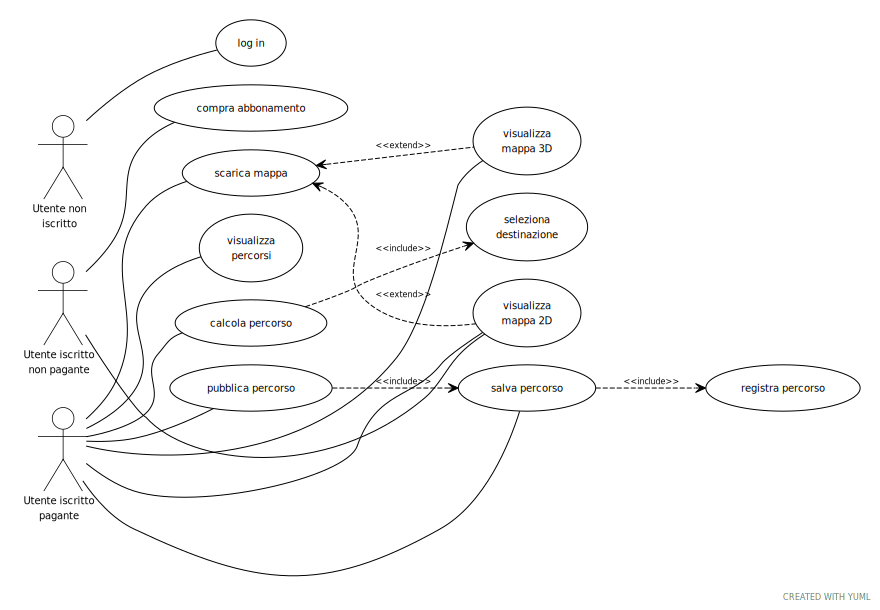

# Alben

## Tagline
Explore the world! without getting lost.

## Descrizione
Un'applicazione che consente di visualizzare mappe 3D sia in modo online che offline per la navigazione di sentieri in montagna. L'applicazione utilizza dati OSM (OpenStreetMap) tramite l'Overpass API per ottenere informazioni su rifugi e sentieri, e dati DEM (Digital Elevation Model) da SRTM (Shuttle Radar Topography Mission) per la rappresentazione del terreno. L'applicazione può collegarsi a un server per scaricare temporaneamente la mappa per l'uso online o permanentemente per l'uso offline. È presente un piano gratuito (funzionalità base) e un piano a pagamento (funzionalità completa). Gli utenti iscritti al piano a pagamento possono registrare, salvare e pubblicare i loro percorsi e a loro volta visualizzare quelli di altre persone.

## Target
Escursionisti / Alpinisti che non conoscono sentieri e vie.

## Problema Risolto
L'app elimina il rischio di perdersi in montagna, causato anche dalla poca segnaletica.

## Tecnologie e Dati
* OpenStreetMap (OSM)
* Overpass API (OSM)
* SRTM DEMs
* Server centrale che gestisce le "tiles" della mappa

## Concorrenti
* Strava (Fatmap)
* Gaia GPS
* AllTrails
* Organic maps
* Mapy.com
* OSMand

## Requisiti
| funzionalità | tipo |
| :--- | :--- |
| utilizzo offline | funzionale |
| visualizzazione mappa 2d | funzionale |
| visualizzazione mappa 3d | funzionale |
| route planning | funzionale |
| geolocalizzazione | funzionale |
| registrazione route | funzionale |
| pubblicazione route | funzionale |
| salvataggio route | funzionale |
| dati sempre aggiornati | non funzionale |
| algoritmo route planning | non funzionale |
| prestazioni (velocità rendering / richiesta tiles) | non funzionale |
| gestione tiles / OSM data | non funzionale |
| dati DEM | dominio |
| dati OSM | dominio |

## Use case diagram

